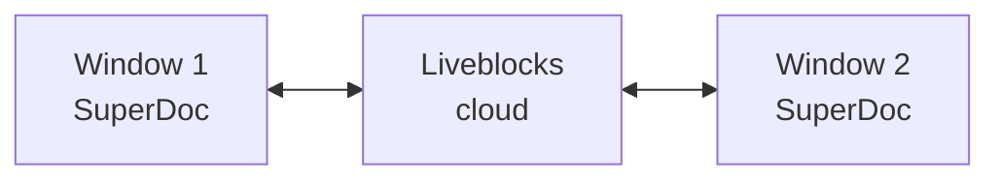

Get real-time collaboration working in 5 minutes using [Liveblocks](https://liveblocks.io/) - no server required.

<Note>
This guide uses Liveblocks because it's the fastest way to get started. See [all providers](/modules/collaboration/overview#choose-your-approach) for alternatives.
</Note>

## Prerequisites

- SuperDoc installed in your project
- A [Liveblocks account](https://liveblocks.io/) (free tier available)

## Step 1: Get your API key

1. Go to [liveblocks.io](https://liveblocks.io/) and create an account
2. Create a new project
3. Copy your **Public API Key** (starts with `pk_`)

## Step 2: Install dependencies

```bash
npm install @liveblocks/client @liveblocks/yjs yjs
```

## Step 3: Add the code

<Tabs>
  <Tab title="React">
    ```tsx
    import { useEffect, useRef } from 'react';
    import { createClient } from '@liveblocks/client';
    import { LiveblocksYjsProvider } from '@liveblocks/yjs';
    import * as Y from 'yjs';
    import { SuperDoc } from 'superdoc';
    import 'superdoc/style.css';

    const client = createClient({
      publicApiKey: 'pk_your_public_key'
    });

    export default function Editor() {
      const superdocRef = useRef<SuperDoc | null>(null);

      useEffect(() => {
        // Enter a room (document ID)
        const { room, leave } = client.enterRoom('my-document');

        // Create Yjs document and provider
        const ydoc = new Y.Doc();
        const provider = new LiveblocksYjsProvider(room, ydoc);

        // Wait for sync before creating editor
        provider.on('sync', (synced: boolean) => {
          if (!synced) return;

          superdocRef.current = new SuperDoc({
            selector: '#superdoc',
            documentMode: 'editing',
            user: {
              name: 'User ' + Math.floor(Math.random() * 1000),
              email: 'user@example.com'
            },
            modules: {
              collaboration: { ydoc, provider }
            }
          });
        });

        // Cleanup on unmount
        return () => {
          superdocRef.current?.destroy();
          provider.destroy();
          leave();
        };
      }, []);

      return <div id="superdoc" style={{ height: '100vh' }} />;
    }
    ```
  </Tab>

  <Tab title="Vue">
    ```vue
    <script setup lang="ts">
    import { onMounted, onBeforeUnmount, shallowRef } from 'vue';
    import { createClient } from '@liveblocks/client';
    import { LiveblocksYjsProvider } from '@liveblocks/yjs';
    import * as Y from 'yjs';
    import { SuperDoc } from 'superdoc';
    import 'superdoc/style.css';

    const client = createClient({
      publicApiKey: 'pk_your_public_key'
    });

    const superdoc = shallowRef<SuperDoc | null>(null);
    let provider: LiveblocksYjsProvider | null = null;
    let leave: (() => void) | null = null;

    onMounted(() => {
      const result = client.enterRoom('my-document');
      leave = result.leave;

      const ydoc = new Y.Doc();
      provider = new LiveblocksYjsProvider(result.room, ydoc);

      provider.on('sync', (synced: boolean) => {
        if (!synced) return;

        superdoc.value = new SuperDoc({
          selector: '#superdoc',
          documentMode: 'editing',
          user: {
            name: 'User ' + Math.floor(Math.random() * 1000),
            email: 'user@example.com'
          },
          modules: {
            collaboration: { ydoc, provider }
          }
        });
      });
    });

    onBeforeUnmount(() => {
      superdoc.value?.destroy();
      provider?.destroy();
      leave?.();
    });
    </script>

    <template>
      <div id="superdoc" style="height: 100vh" />
    </template>
    ```
  </Tab>

  <Tab title="Vanilla JS">
    ```html
    <!DOCTYPE html>
    <html>
    <head>
      <link rel="stylesheet" href="node_modules/superdoc/dist/style.css">
    </head>
    <body>
      <div id="superdoc" style="height: 100vh"></div>

      <script type="module">
        import { createClient } from '@liveblocks/client';
        import { LiveblocksYjsProvider } from '@liveblocks/yjs';
        import * as Y from 'yjs';
        import { SuperDoc } from 'superdoc';

        const client = createClient({
          publicApiKey: 'pk_your_public_key'
        });

        const { room } = client.enterRoom('my-document');
        const ydoc = new Y.Doc();
        const provider = new LiveblocksYjsProvider(room, ydoc);

        provider.on('sync', (synced) => {
          if (!synced) return;

          new SuperDoc({
            selector: '#superdoc',
            documentMode: 'editing',
            user: {
              name: 'User ' + Math.floor(Math.random() * 1000),
              email: 'user@example.com'
            },
            modules: {
              collaboration: { ydoc, provider }
            }
          });
        });
      </script>
    </body>
    </html>
    ```
  </Tab>
</Tabs>

## Step 4: Test it

1. Open your app in two browser windows
2. Start typing in one window
3. Watch changes appear in real-time in the other window

<Check>
You now have real-time collaboration working!
</Check>

## What's happening?



1. **Liveblocks** handles the WebSocket connection and data sync
2. **Yjs** manages the document state and conflict resolution
3. **SuperDoc** renders the editor and syncs with Yjs

## Adding user presence

Show who's currently editing:

```javascript
const superdoc = new SuperDoc({
  // ... other config
  onAwarenessUpdate: ({ states }) => {
    const users = states.filter(s => s.user);
    console.log('Active users:', users);

    // Update your UI
    updateUserList(users.map(u => ({
      name: u.user.name,
      color: u.user.color
    })));
  }
});
```

## Environment variables

For production, use environment variables:

```javascript
const client = createClient({
  publicApiKey: import.meta.env.VITE_LIVEBLOCKS_PUBLIC_KEY
  // or process.env.NEXT_PUBLIC_LIVEBLOCKS_KEY for Next.js
});
```

## Next steps

<CardGroup cols={2}>
  <Card
    title="Liveblocks Deep Dive"
    icon="cloud"
    href="/guides/collaboration/liveblocks"
  >
    Room management, persistence, and advanced features
  </Card>

  <Card
    title="Self-Hosted Option"
    icon="server"
    href="/guides/collaboration/superdoc-yjs"
  >
    Run your own collaboration server
  </Card>

  <Card
    title="Client Configuration"
    icon="settings"
    href="/modules/collaboration/configuration"
  >
    All events, options, and customization
  </Card>

  <Card
    title="Working Example"
    icon="github"
    href="https://github.com/superdoc-dev/superdoc/tree/main/examples/collaboration/liveblocks"
  >
    Complete source code on GitHub
  </Card>
</CardGroup>
